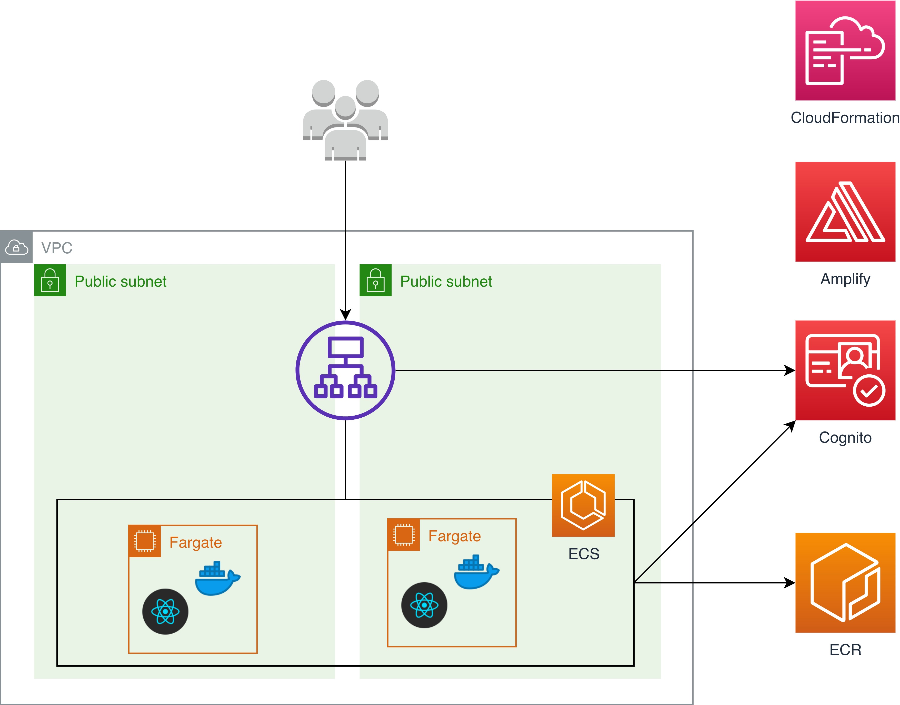

# AWS Amplify React Docker Fargate Github Actions Example




## Prerequisites
* npm
* yarn
* ECR repository (see `ECR_REPOSITORY` in [pipeline.yml](./.github/workflows/pipeline.yml))
* Amplify IAM user with `AdministratorAccess` policy
* Github Actions IAM user with these policies:
  * `AmazonEC2FullAccess`
  * `IAMFullAccess`
  * `ElasticLoadBalancingFullAccess`
  * `CloudWatchLogsFullAccess`
  * `AmazonECS_FullAccess`
  * `AmazonEC2ContainerRegistryPowerUser`
  * `AWSCloudFormationFullAccess`


## Getting started

```
npm install -g @aws-amplify/cli
npm i --save @aws-amplify/ui
amplify init
amplify add auth
amplify push
yarn add aws-amplify aws-amplify-react aws-amplify-react-native
npm start
```

## Deployment
For deployment options, see [pipeline.yml](./.github/workflows/pipeline.yml)